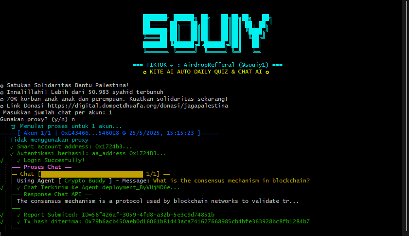

# 📝 Galkite AutoInteraction - README

 *(Gambar ilustrasi)*

## 📌 Deskripsi
Galkite AutoInteraction adalah script otomatis untuk berinteraksi dengan platform Kite AI, melakukan:
- Chat otomatis dengan berbagai AI Agent (Professor, Crypto Buddy, Sherlock)
- Penyelesaian Daily Quiz otomatis
- Pelacakan XP Points dan ranking

Script ini dikembangkan oleh **SOUIY** untuk memudahkan pengguna dalam mengumpulkan poin XP secara efisien.

## 🚀 Fitur Utama
- ✅ Auto Chat dengan 3 AI Agent berbeda
- ✅ Auto Daily Quiz dengan jawaban otomatis
- ✅ Dukungan multi-akun
- ✅ Dukungan proxy (opsional)
- ✅ Pelaporan statistik akun
- ✅ Penjadwalan otomatis (setiap 24 jam)

## ⚙️ Prasyarat
- Node.js v18 atau lebih baru
- NPM atau Yarn
- Koneksi internet stabil

## 📥 Instalasi

### 1. Clone Repository
```bash
git clone https://github.com/Souiy/Galkite-AutoInteraction-SOUIY.git
cd Galkite-AutoInteraction-SOUIY
```

### 2. Install Dependencies
```bash
npm install
```
atau
```bash
yarn install
```

### 3. Siapkan File Konfigurasi
Buat file-file berikut di folder project:

#### 📄 accounts.txt
Berisi private key wallet (1 private key per baris)
```
nano accounts.txt

```

#### 📄 pesan_professor.txt
Berisi daftar pesan untuk Agent Professor (1 pesan per baris)
```
Apa pendapat Anda tentang teknologi blockchain?
Bagaimana cara kerja smart contract?
...
```

#### 📄 pesan_cryptobuddy.txt
Berisi daftar pesan untuk Agent Crypto Buddy (1 pesan per baris)
```
Apa prediksi harga BTC tahun depan?
Bagaimana cara memulai investasi crypto?
...
```

#### 📄 proxy.txt (opsional)
Berisi daftar proxy (1 proxy per baris, format: http://user:pass@ip:port)
```
nano proxy.txt

```

## 🏃‍♂️ Cara Menjalankan

### Mode Normal (dengan animasi ketik)
```bash
node index.js
```

### Mode Cepat (tanpa animasi ketik)
```bash
node index.js --no-type
```

### Panduan Interaktif
Setelah menjalankan script, Anda akan diminta untuk:
1. Masukkan jumlah chat per akun (rekomendasi: 3-5)
2. Pilih apakah ingin menggunakan proxy (y/n)

## ⚠️ Catatan Penting
1. Script ini dibuat untuk **testnet** Gokite.ai
2. Pastikan wallet memiliki sedikit ETH di jaringan testnet untuk gas fee
3. Jangan gunakan private key wallet utama Anda
4. Script ini dijalankan atas risiko pengguna
5. Dilarang digunakan untuk tujuan ilegal

## 🔄 Penjadwalan
Script akan berjalan otomatis setiap 24 jam setelah eksekusi pertama. Anda bisa melihat countdown untuk eksekusi berikutnya di console.

## 📊 Statistik
Setelah selesai, script akan menampilkan:
- Jumlah akun yang sukses/gagal
- XP Points terkini
- Ranking akun
- Jumlah interaksi per Agent

## 🤝 Kontribusi
Pull request dipersilakan. Untuk perubahan besar, buka issue terlebih dahulu untuk didiskusikan.

## 📜 Lisensi
MIT License

## ✉️ Kontak
- TikTok: [@souiy1](https://www.tiktok.com/@souiy1)
- GitHub: [Souiy](https://github.com/Souiy)

---

**✪ Satukan Solidaritas Bantu Palestina!**  
**✪ Innalillahi! Lebih dari 50.983 syahid terbunuh**  
**✪ 70% korban anak-anak dan perempuan. Kuatkan solidaritas sekarang!**  
**✪ Link Donasi: https://digital.dompetdhuafa.org/donasi/jagapalestina**
